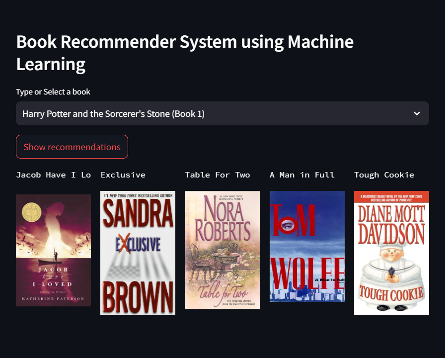

# Book Recommendation System

This project aims to develop a book recommendation system using collaborative filtering techniques. The system processes and cleans datasets containing over 1 million book ratings, filters out inactive users to focus on meaningful data, and constructs a pivot table for user ratings. The core of the recommendation system is implemented using a K-Nearest Neighbors (KNN) model, which suggests the top 5 similar books based on user preferences. This project not only enhances user experience by providing personalized book recommendations but also demonstrates effective data handling and machine learning model implementation.

## Key Features

- **Data Processing and Cleaning**: Efficiently handled and cleaned datasets with over 1 million ratings.
- **User Filtering**: Focused on active users by filtering out those with fewer than 200 ratings.
- **Pivot Table Creation**: Created a pivot table for user ratings with dimensions of 742 books and 888 users.
- **K-Nearest Neighbors Model**: Implemented a KNN model to recommend the top 5 similar books.

## Numeric Achievements

- **Books DataFrame**: Reduced to relevant columns with a shape of `(271360, 5)`.
- **Users DataFrame**: Filtered to retain active users with a shape of `(278858, 3)`.
- **Ratings DataFrame**: Filtered for active users, resulting in a final shape of `(1031136, 6)`.
- **Pivot Table**: Created for the recommendation model with a shape of `(742, 888)`.

## Usage

1. **Data Preparation**: Load and preprocess the datasets.
2. **Model Training**: Train the K-Nearest Neighbors model using the pivot table.
3. **Recommendations**: Use the trained model to generate book recommendations.

# Using Streamlit:

